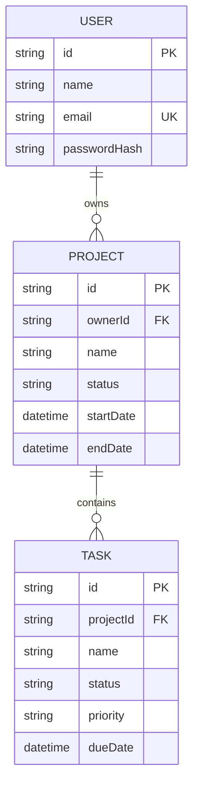

# Taskflow

A project and task manager with a responsive React web app, an Expo Android app, and one Express API backed by PostgreSQL. Both clients use the same REST API and database.

## Requirements

- Node.js 20+
- npm 10+
- PostgreSQL 15+ (or Docker)
- Expo Go for a quick Android preview; Android Studio for a native build

## Run locally

1. Copy `apps/api/.env.example` to `apps/api/.env` and set a long `JWT_SECRET` and your PostgreSQL `DATABASE_URL`.
2. From the repository root, run `npm install`.
3. Run `npm run db:generate` and `npm run db:migrate`.
4. In separate terminals run `npm run dev:api`, `npm run dev:web`, and optionally `npm run dev:mobile`.
5. Open the Vite URL printed in the web terminal. Open Expo Go on Android and scan the QR code. Set `EXPO_PUBLIC_API_URL` to a URL reachable from the phone (for example your computer's LAN IP); `localhost` on a phone refers to the phone itself.

For Docker PostgreSQL, start a local database with `docker compose up -d db` before running the migrations.

## Environment variables

| Variable | App | Description |
| --- | --- | --- |
| `DATABASE_URL` | API | PostgreSQL connection string |
| `JWT_SECRET` | API | Secret used to sign access tokens (32+ random characters) |
| `JWT_EXPIRES_IN` | API | Access token lifetime (default `7d`) |
| `PORT` | API | API port (default `4000`) |
| `HOST` | API | Bind address (default `127.0.0.1`; set to `0.0.0.0` only when a phone on your LAN must reach the API) |
| `WEB_ORIGIN` | API | Allowed web origin (default `http://localhost:5173`) |
| `VITE_API_URL` | Web | API base URL (default `http://localhost:4000/api`) |
| `EXPO_PUBLIC_API_URL` | Mobile | API base URL including `/api`; use a LAN or deployed URL on a physical phone |

## API

All endpoints are prefixed with `/api`. Register and login return `{ user, token }`. Send `Authorization: Bearer <token>` for protected routes. Logout is stateless and clients discard the token. Expired/invalid tokens return `401`.

- `POST /auth/register`, `/auth/login`, `/auth/logout`; `GET /auth/me`
- `GET/POST /projects`; `GET/PUT/DELETE /projects/:id`
- `GET/POST /tasks`; `GET/PUT/DELETE /tasks/:id`
- `GET /dashboard`

List endpoints accept `search`, `status`, `priority`, `projectId`, `page`, and `limit` as relevant. Responses include `items`, `page`, `limit`, and `total` for paginated lists. See `apps/api/src` for request validation and response shapes.

## Database

Prisma schema and migration history are in `apps/api/prisma`. A user owns projects; tasks belong to projects and are scoped through the owning user. Cascading deletes remove a project's tasks. `docker compose up -d db` starts the optional local PostgreSQL service.

The full endpoint guide is in [API.md](./API.md).

## Mobile secure storage and builds

The Expo app stores its JWT using `expo-secure-store` (Android Keystore-backed storage), supports pull-to-refresh and reports network/expired-session errors. For an APK, configure an EAS Android build with an `eas.json` profile and run `eas build --platform android --profile preview` after installing/configuring EAS CLI. Point `EXPO_PUBLIC_API_URL` at your deployed API for distribution.

## Deployment

Deploy the API and PostgreSQL database, apply `prisma migrate deploy`, and set the API environment variables. Deploy `apps/web` as a Vite static site with `VITE_API_URL` and allow its origin via `WEB_ORIGIN`. Build the Expo app with the same API URL. This repository does not include hosted URLs or distribution credentials.

### Render preview

The root `render.yaml` defines a single public web service for both the React web app and `/api`, plus PostgreSQL. Create a Blueprint in Render connected to this repository to deploy it. The free PostgreSQL plan is for preview use: Render deletes free databases after 30 days unless they are upgraded, so use a persistent paid database for ongoing use.
